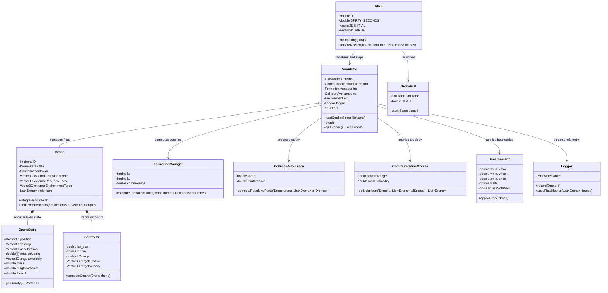
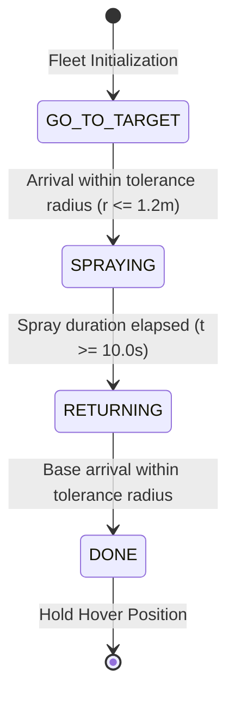

# Autonomous Agricultural Drone Swarm Simulator

A high-fidelity, physics-based 3D simulation platform for autonomous multi-rotor drone fleets executing precision agricultural surveying and pesticide dispensing missions. Developed in Java with JavaFX 3D visualization, the system implements 6-DOF rigid-body dynamics, decentralized consensus formation control, artificial potential field collision avoidance, stochastic communication loss modeling, and real-time telemetry streaming.

---

## Table of Contents

1. [System Overview](#system-overview)
2. [Architecture and Design](#architecture-and-design)
3. [Mathematical and Physical Models](#mathematical-and-physical-models)
   - [6-DOF Translational Dynamics](#6-dof-translational-dynamics)
   - [Rotational Kinematics and SO(3) Integration](#rotational-kinematics-and-so3-integration)
   - [Flight Control System](#flight-control-system)
   - [Consensus Formation Control](#consensus-formation-control)
   - [Artificial Potential Field Collision Avoidance](#artificial-potential-field-collision-avoidance)
   - [Stochastic Mesh Communication](#stochastic-mesh-communication)
4. [Mission Finite State Machine](#mission-finite-state-machine)
5. [Visualization and Telemetry](#visualization-and-telemetry)
6. [Repository Structure](#repository-structure)
7. [Configuration Parameters](#configuration-parameters)
8. [Prerequisites and Installation](#prerequisites-and-installation)
9. [Building and Execution](#building-and-execution)
10. [Automated Daily Deployment Pipeline](#automated-daily-deployment-pipeline)
11. [License](#license)

---

## System Overview

Precision agriculture increasingly relies on coordinated autonomous aerial vehicles to survey crops and perform targeted chemical spraying. Managing multi-drone swarms requires solving simultaneous distributed control challenges: maintaining tight geometric flight formations, preventing inter-agent collisions, compensating for wind and aerodynamic drag, and operating under intermittent wireless link dropouts.

This project delivers a discrete-time, physics-driven multi-agent simulation that models:
- Dynamic multi-drone fleet coordination without centralized ground intervention.
- Real-time physics integration combining gravity, drag, net thrust vectors, and environmental boundary forces.
- Distributed neighbor discovery subject to communication distance cutoffs and random packet drop probability.
- Precision agricultural mission sequencing: base dispatch, target traversal, localized pesticide dispersion, and synchronized return-to-base.
- Hardware-accelerated 3D rendering with live particle dispersion trails and HUD flight metrics.

---

## Architecture and Design

The simulation is architected according to Object-Oriented Design (OOD) principles, enforcing modular separation between physical state representation, control laws, numerical integration, communication topology, and visual rendering.



---

## Mathematical and Physical Models

### 6-DOF Translational Dynamics

Each unmanned aerial vehicle (UAV) is modeled as a rigid body of mass $m$ subjected to gravitational acceleration, aerodynamic drag, total propeller thrust, and interaction forces:

$$\mathbf{F}_{\text{net}} = \mathbf{F}_{\text{gravity}} + \mathbf{F}_{\text{thrust}} + \mathbf{F}_{\text{drag}} + \mathbf{F}_{\text{formation}} + \mathbf{F}_{\text{repulsive}} + \mathbf{F}_{\text{env}}$$

Where:
- $\mathbf{F}_{\text{gravity}} = m \begin{bmatrix} 0 & 0 & -g \end{bmatrix}^T$ with $g = 9.81 \, \text{m/s}^2$
- $\mathbf{F}_{\text{thrust}} = \mathbf{R} \begin{bmatrix} 0 & 0 & T_z \end{bmatrix}^T$, mapping vertical thrust $T_z$ in the body frame into inertial space via rotation matrix $\mathbf{R} \in SO(3)$
- $\mathbf{F}_{\text{drag}} = -k_d \, \mathbf{v}$, representing linear atmospheric drag opposing velocity $\mathbf{v}$

The translational state is propagated through forward numerical integration:

$$\mathbf{a}(t) = \frac{\mathbf{F}_{\text{net}}(t)}{m}$$

$$\mathbf{v}(t + \Delta t) = \mathbf{v}(t) + \mathbf{a}(t) \, \Delta t$$

$$\mathbf{p}(t + \Delta t) = \mathbf{p}(t) + \mathbf{v}(t + \Delta t) \, \Delta t$$

### Rotational Kinematics and SO(3) Integration

Attitude orientation is parameterized as an orthogonal direction cosine matrix $\mathbf{R} \in SO(3)$. Angular velocity vector $\boldsymbol{\omega}$ over interval $\Delta t$ defines an incremental rotation vector $\mathbf{w} = \boldsymbol{\omega} \, \Delta t$ with magnitude $\theta = \|\mathbf{w}\|_2$ and unit axis $\mathbf{k} = \mathbf{w} / \theta$.

The instantaneous rotation update matrix $\mathbf{V}_r$ is computed using Rodrigues' rotation formula:

$$\mathbf{V}_r = \mathbf{I} + (\sin \theta) \mathbf{K} + (1 - \cos \theta) \mathbf{K}^2$$

Where $\mathbf{K}$ is the skew-symmetric cross-product matrix of unit vector $\mathbf{k}$:

$$\mathbf{K} = \begin{bmatrix} 0 & -k_z & k_y \\ k_z & 0 & -k_x \\ -k_y & k_x & 0 \end{bmatrix}$$

The updated orientation is evaluated as:

$$\mathbf{R}(t + \Delta t) = \mathbf{R}(t) \, \mathbf{V}_r$$

### Flight Control System

Each UAV utilizes a Proportional-Derivative (PD) tracking controller augmented with feedforward gravity compensation:

$$\mathbf{e}_p = \mathbf{p}_{\text{target}} - \mathbf{p}$$

$$\mathbf{e}_v = \mathbf{v}_{\text{target}} - \mathbf{v}$$

$$\mathbf{a}_{\text{cmd}} = k_{p,\text{pos}} \, \mathbf{e}_p + k_{v,\text{vel}} \, \mathbf{e}_v + \mathbf{g}_{\text{comp}}$$

The vertical thrust command is computed to track the required vertical acceleration:

$$T_z = m \, a_{\text{cmd}, z}$$

Rotational rate damping applies restoring body torques proportional to angular velocity:

$$\boldsymbol{\tau} = -k_\Omega \, \boldsymbol{\omega}$$

### Consensus Formation Control

Swarm cohesion and relative alignment are maintained using a consensus-based distributed spring-damper coupling across connected neighbors $\mathcal{N}_i$:

$$\mathbf{F}_{\text{form}, i} = -\sum_{j \in \mathcal{N}_i} \left[ k_p (\mathbf{p}_i - \mathbf{p}_j) + k_v (\mathbf{v}_i - \mathbf{v}_j) \right]$$

- $k_p$: Position stiffness gain driving inter-drone separation to zero relative drift.
- $k_v$: Velocity damping gain synchronizing fleet travel speeds.

### Artificial Potential Field Collision Avoidance

To guarantee collision-free flight, an inverse-square repulsive potential field activates whenever neighbor separation falls below safety threshold $d_{\text{min}}$:

$$\mathbf{F}_{\text{rep}, i} = \sum_{j \in \mathcal{N}_i, \, \|\mathbf{r}_{ij}\| < d_{\text{min}}} k_{\text{rep}} \, \frac{\mathbf{p}_i - \mathbf{p}_j}{\|\mathbf{p}_i - \mathbf{p}_j\|^2}$$

This formulation generates steep repulsive forces at close proximity, driving converging trajectories apart before a collision threshold is violated.

### Stochastic Mesh Communication

Inter-drone connectivity is modeled dynamically rather than assumed static:
1. **Geometric Visibility Range**: Agent $j$ is considered in range of agent $i$ if Euclidean distance satisfies $\|\mathbf{p}_i - \mathbf{p}_j\|_2 \le R_{\text{comm}}$.
2. **Packet Drop Model**: Even if in physical range, wireless packet transmission experiences independent Bernoulli trial loss with probability $P_{\text{loss}} \in [0, 1]$.
3. **Neighbor Set**: Agent $j$ enters neighbor set $\mathcal{N}_i$ if and only if both conditions are satisfied for the current simulation step.

---

## Mission Finite State Machine

The mission pipeline coordinates the fleet through four distinct operational phases:



| Phase | Description | Control Objective |
| :--- | :--- | :--- |
| `GO_TO_TARGET` | Transit from base coordinates to agricultural spray coordinates. | Steer velocity vector toward target point with smoothed velocity blending ($25\%$) up to maximum speed ($4.0 \, \text{m/s}$). |
| `SPRAYING` | Stationary precision pesticide dispensing over designated target zone. | Zero horizontal velocity ($\mathbf{v}_{xy} = 0$), maintain altitude at $10.0 \, \text{m}$, activate particle trail generator for $10.0 \, \text{s}$. |
| `RETURNING` | Autonomous return-to-base transit after chemical payload completion. | Steer velocity vector back toward initial takeoff coordinates with velocity clamping. |
| `DONE` | Mission completion and station keeping. | Zero-velocity hover at base coordinates. Final simulation metrics written to disk. |

---

## Visualization and Telemetry

### JavaFX 3D Environment
- **Perspective Camera**: Dynamic view frustum positioning with pitch rotation and depth clipping ($0.1$ to $10,000.0$ units).
- **Cartesian Grid and Coordinate Axes**: Metric grid lines with color-coded 3D axes (X: Red, Y: Green, Z: Blue).
- **Drone Assembly**: Distinct 3D mesh representations featuring central fuselage, cross-arms, and rotor assemblies.
- **Dispersion Trails**: Real-time emission of colored particles during active spraying phases, tracking continuous spatial coverage.
- **Heads-Up Display (HUD)**: Semi-transparent status overlay displaying continuous elapsed mission time $t$ and integration step $\Delta t$.

### Telemetry Streaming
Every simulation step writes synchronized vehicle states to `positions.csv`:
```csv
DroneID,PosX,PosY,PosZ,VelX,VelY,VelZ,ThrustZ
0,0.03,-0.07,9.80,0.33,-0.69,-1.96,-11.77
1,2.59,-0.08,9.80,0.87,-0.76,-1.96,-11.77
```

Upon mission conclusion, `metrics.txt` summarizes execution integrity and fleet statistics.

---

## Repository Structure

```
.
|-- .gitignore                  # Git exclusion rules for builds and logs
|-- README.md                   # System documentation and architecture manual
|-- config.txt                  # Simulation runtime configuration file
|-- .classpath                  # Eclipse IDE classpath configuration
|-- .project                    # Eclipse IDE project descriptor
|-- build.fxbuild               # JavaFX build task descriptor
|-- daily_push.ps1              # Automation engine for daily scheduled commits
|-- push_manifest.json          # Queue state for progressive daily releases
|-- setup_daily_task.ps1        # Windows Task Scheduler registration script
`-- src/
    `-- application/
        |-- CollisionAvoidance.java      # Artificial potential field repulsion
        |-- CommunicationModule.java     # Stochastic mesh networking
        |-- Controller.java              # PD position and attitude controller
        |-- Drone.java                   # 6-DOF dynamic integrator and force aggregator
        |-- DroneGUI.java                # JavaFX 3D world, camera, and particle render
        |-- DroneState.java              # Rigid-body kinematic and orientation state
        |-- Environment.java             # Boundary enforcement and wall potentials
        |-- FormationManager.java        # Consensus-based swarm formation coupling
        |-- Logger.java                  # CSV telemetry and metrics exporter
        |-- Main.java                    # Mission state machine and entry point
        |-- Simulator.java               # Discrete-time simulation engine
        |-- Vector3D.java                # 3D Euclidean vector algebra library
        `-- application.css              # JavaFX UI stylesheet
```

---

## Configuration Parameters

Simulation parameters are configured via `config.txt` without requiring re-compilation:

| Parameter | Type | Default | Description |
| :--- | :--- | :--- | :--- |
| `numDrones` | Integer | `5` | Total number of UAVs initialized in the fleet |
| `timeStep` | Double | `0.1` | Discrete numerical integration delta ($\Delta t$ in seconds) |
| `width` | Double | `100.0` | Spatial boundary along X-axis ($-w/2$ to $+w/2$ meters) |
| `height` | Double | `100.0` | Spatial boundary along Y-axis ($-h/2$ to $+h/2$ meters) |
| `mass` | Double | `1.2` | Vehicle mass per drone ($m$ in kilograms) |
| `kd` | Double | `0.1` | Linear aerodynamic drag coefficient |
| `kp` | Double | `1.5` | Formation position coupling gain |

---

## Prerequisites and Installation

### Software Requirements
- **Java Development Kit (JDK)**: Version 21 or higher (OpenJDK or Oracle JDK).
- **JavaFX SDK**: Version 21 or higher compatible with your platform architecture.
- **IDE (Optional)**: Eclipse IDE for Java Developers with e(fx)clipse plugin, IntelliJ IDEA, or VS Code.
- **Git**: Version 2.30 or higher.

---

## Building and Execution

### Command-Line Compilation (Linux / macOS / Windows PowerShell)

1. Set the JavaFX library path:
   ```bash
   # Windows PowerShell
   $env:PATH_TO_FX="C:\path\to\javafx-sdk-21\lib"

   # Linux / macOS
   export PATH_TO_FX=/path/to/javafx-sdk-21/lib
   ```

2. Compile all source files:
   ```bash
   javac --module-path $env:PATH_TO_FX --add-modules javafx.controls,javafx.graphics -d bin src/application/*.java
   ```

3. Copy runtime resources:
   ```bash
   cp config.txt bin/
   cp src/application/application.css bin/application/
   ```

4. Run the simulation:
   ```bash
   java --module-path $env:PATH_TO_FX --add-modules javafx.controls,javafx.graphics -cp bin application.Main
   ```

### Eclipse IDE Setup

1. Open Eclipse and select **File -> Import -> Existing Projects into Workspace**.
2. Browse to the repository root and select `Simtest`.
3. Ensure the project build path targets JDK 21 and the configured `JavaFX` User Library.
4. Right-click `src/application/Main.java` and select **Run As -> Java Application**.

---

## Automated Daily Deployment Pipeline

This repository includes an automated progressive release pipeline designed to publish one file per day, maintaining structured revision history.

### Pipeline Components
- **`push_manifest.json`**: An ordered dependency queue defining the chronological release sequence across all modules.
- **`daily_push.ps1`**: Execution script that queries the queue, commits the day's designated module with conventional commit syntax, pushes to GitHub, and updates tracking timestamps.
- **`setup_daily_task.ps1`**: Registration script configuring a native Windows Scheduled Task (`AutonomousDroneSwarm_DailyPusher`) set to trigger automatically at 10:00 AM daily.

### Triggering Manual or Scheduled Execution

To execute the daily push manually:
```powershell
powershell -ExecutionPolicy Bypass -File .\daily_push.ps1
```

To register or inspect the Windows Scheduled Task:
```powershell
powershell -ExecutionPolicy Bypass -File .\setup_daily_task.ps1
```

---

## License

This project is developed as an academic and engineering research simulation. Distributed under the MIT License.
